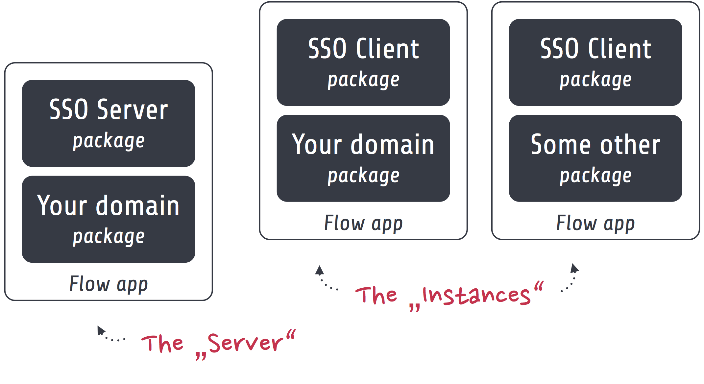
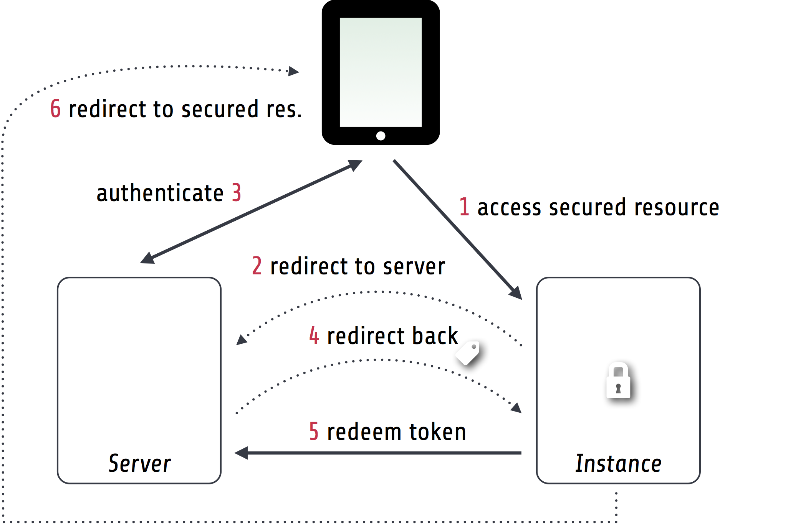

Flowpack Single Sign-on Server Documentation
--------------------------------------------

*This version of the documentation has been rendered at:* |today|

======================================
Overview
======================================

The Flowpack single sign-on packages provide a distributed authentication and authorization solution for
TYPO3 Flow applications. It is based on the Flow security framework and makes no special assumptions about the
actual authentication method, source of account data and the authorization data that is exchanged between the systems.

Architecture
=============

Instance:
Server:

Features
=============

* Easy integration into existing TYPO3 Flow applications
* Flow security framework integration
* Flexible account data mapping
* Session expiration synchronization
* Remote session management capabilities
* Single Sign-off
* Account switching (impersonate)
* Sessions can use existing Flow cache backends (*Redis*, *Memcache*, *APC*)

How it works
============

This is a simple roundtrip for access to a secured resource on an instance without prior authentication:

1. A user accesses a secured resource on an instance
2. Since no account is authenticated on the instance the user is redirected to a configured server
3. The user will authenticate on the server through a configured authentication provider (e.g. username / password)
4. The server redirects back to the instance and passes an encrypted access token
5. The instance checks the access token and does a server-side request to redeem the token on the server,
	the server returns the account data and authorization information (roles)
6. The instance authenticates an account locally and redirects to the original secured resource

======================================
Getting started
======================================

Setting up the Vagrant demo.

======================================
Usage
======================================

Setting up an SSO server
========================

Integration the SSO client
==========================

======================================
Extensions
======================================

======================================
Development
======================================

Running the tests
=================

