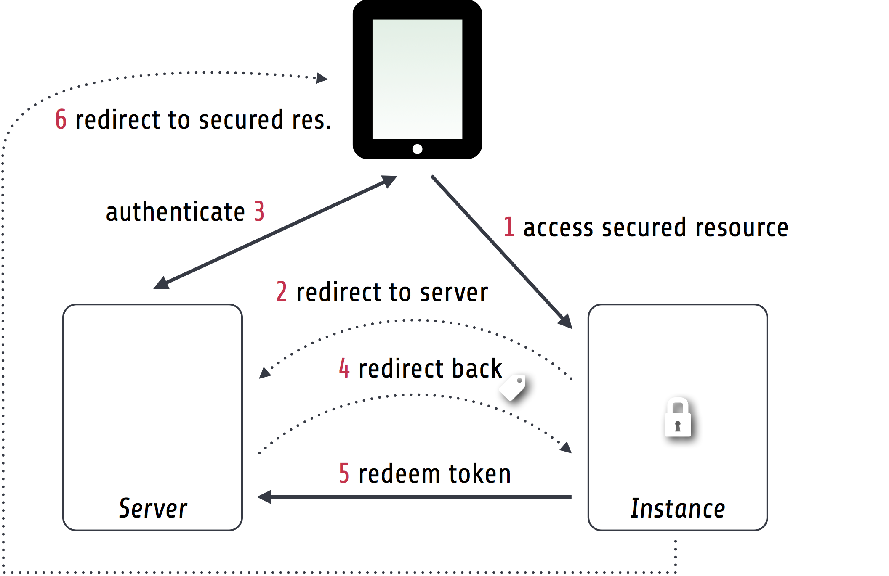

Flowpack Single sign-on Documentation
--------------------------------------------

*This version of the documentation has been rendered at:* |today|

======================================
Overview
======================================

The Flowpack Single sign-on packages provide a distributed authentication and authorization solution for
TYPO3 Flow applications. It is based on the Flow security framework and makes no special assumptions about the
actual authentication method, source of account data and the authorization data that is exchanged between the systems.

Architecture
=============

.. image:: Images/sso-overview.png
        :alt: An overview of the packages
        :width: 80%
        :align: center

Instance
    A (TYPO3 Flow) application that utilizes a Single sign-on server for authentication using the `Client package`_.
    The Flowpack Single sign-on can be one of multiple authentication methods. Usually there will be a larger number of
    instances in a typical setup.
Server
    A Single sign-on server is a TYPO3 Flow application that provides a central authentication system which is accessed
    by the instances. The server consists of the `Server package`_ and a domain package that implements a
    party model for the authentication and provides possible extensions to the Single sign-on data exchange.

.. _Client package: http://github.com/Flowpack/Flowpack.SingleSignOn.Client/
.. _Server package: http://github.com/Flowpack/Flowpack.SingleSignOn.Server/

The architecture is designed to be *highly extensible* and *fully integratable* in an existing TYPO3 Flow application.

Features
=============

* Easy integration into existing TYPO3 Flow applications
* Flow security framework integration, re-use of existing authentication providers (e.g. *LDAP*, *UsernamePassword*, *OpenID*)
* Flexible account data mapping (transfer custom properties of parties)
* Session expiration synchronization
* Remote session management capabilities
* Single Sign-off
* Account switching (impersonate)
* Sessions can use existing Flow cache backends (*Redis*, *Memcache*, *APC*)
* RSA signing of server-side requests

How it works
============

This is a simple roundtrip for access to a secured resource on an instance without prior authentication:

1. A user accesses a secured resource on an instance
2. Since no account is authenticated on the instance the user is redirected to a configured server
3. The user will authenticate on the server through a configured authentication provider (e.g. username / password)
4. The server redirects back to the instance and passes an encrypted access token
5. The instance checks the access token and does a server-side request to redeem the token on the server,
   the server returns the account data and authorization information (roles)
6. The instance authenticates an account locally and redirects to the original secured resource

======================================
Getting started
======================================

We provide TYPO3 Flow demo applications for both the server and an instance. To make the setup easier we
also provide the demo in a Vagrant_ box (a tool for a development environment in virtual machines).

.. WARNING:: Do not use the *Flowpack.SingleSignOn.DemoServer* package in production! It contains code that is used for
   testing and allows creation of users and session management over an unsecured HTTP API.

.. _demo credentials:

Demo credentials for testing:

======== ======== =============
Username Password Role
======== ======== =============
admin    password Administrator
user1    password User
user2    password User
======== ======== =============

Setting up the Vagrant demo
===========================

First install Vagrant_ for your operating system and install the `librarian` gem for downloading the bundled cookbooks::

    > librarian-chef install
      ...
    > vagrant up

The virtual machine should now boot and start to provision the demo setup (this can take a while).

Set up host entries in your `/etc/hosts` (or similar file, depending on your operating system)::

    10.11.12.23 ssodemoserver.vagrant
    10.11.12.23 ssodemoinstance.vagrant ssodemoinstance2.vagrant

Browse to http://ssodemoserver.vagrant/ and you should see the demo server frontend. A second instance is available on
http://ssodemoserver2.vagrant/ for running multi-instance acceptance tests.

.. _Vagrant: http://www.vagrantup.com/

Manually setting up the demo server and instance
================================================

The demo setup consists of a demo server and a demo instance bundled in two TYPO3 Flow distributions. You should follow
the steps in the `TYPO3 Flow quickstart`_ for a general setup for Flow development if not yet done.

Each distribution should be cloned into a separate directory::

    mkdir singlesignon-demo
    cd singlesignon-demo

*Setting up the server*

-----

Clone the repository, install dependencies with Composer::

    git clone https://github.com/Flowpack/Flowpack.SingleSignOn.DemoServer-Distribution.git DemoServer
    cd DemoServer
    path/to/composer.phar install --dev

Create a `Configuration/Settings.yaml`:

.. code-block:: yaml

    TYPO3:
      Flow:
        persistence:
          backendOptions:
            dbname: ssodemoserver # Create this database
            host: localhost
            user: root   # Fill in username
            password: '' # Fill in password

    Flowpack:
      SingleSignOn:
        Server:
          server:
            serviceBaseUri: 'http://ssodemoserver.local/sso/'
            publicKeyFingerprint: ''

        DemoServer:
          demoInstanceUri: 'http://ssodemoinstance.local/'
          clients:
            -
              serviceBaseUri: 'http://ssodemoinstance.local/sso/'

Run migrations and demo setup::

    ./flow doctrine:migrate
    ./flow flowpack.singlesignon.demoserver:demo:setup

*Setting up the instance*

-----

Clone the repository, install dependencies with Composer::

    git clone https://github.com/Flowpack/Flowpack.SingleSignOn.DemoInstance-Distribution.git DemoInstance
    cd DemoInstance
    path/to/composer.phar install --dev

Create a `Configuration/Settings.yaml`:

.. code-block:: yaml

    TYPO3:
      Flow:
        persistence:
          backendOptions:
            dbname: ssodemoinstance # Create this database
            host: localhost
            user: root   # Fill in username
            password: '' # Fill in password

    Flowpack:
      SingleSignOn:
        Client:
          client:
            serviceBaseUri: 'http://ssodemoinstance.local/sso/'
            publicKeyFingerprint: ''
          server:
            DemoServer:
              serviceBaseUri: 'http://ssodemoserver.local/sso/'
              publicKeyFingerprint: ''

        DemoInstance:
          demoServerUri: 'http://ssodemoserver.local/'

Run migrations and demo setup::

    ./flow doctrine:migrate
    ./flow flowpack.singlesignon.demoinstance:demo:setup

-----

You should create a virtual host configuration for both distributions. We expect the hosts `ssodemoinstance.local` and
`ssodemoserver.local` for the example configuration.

After setting up everyhting you should be able to access http://ssodemoserver.local/ and see the demo server frontpage.

.. _TYPO3 Flow quickstart: http://docs.typo3.org/flow/TYPO3FlowDocumentation/Quickstart/

Demo walkthrough
================

You could test the following scenarios:

* Go to demo instance, request *secure action*: A login form on the server will be displayed. After login with one of
  the `demo credentials`_ you should be redirected back to the secure action and be authenticated on the server and instance.
* Authenticate on server, request *secure action* on instance: No login form is displayed if an authenticated session
  already exists and the session is transferred to the instance using redirects and server-side requests.
* Authenticate on server and instance, logout from server: When going to the instance again you should see, that the
  session was automatically invalidated using a server-side request.
* Authenticate on server and instance, logout on instance: When going to the server you should see, that the
  session was automatically invalidated using a server-side request.

*About the demo server*

The demo server distribution has a package `Flowpack.SingleSignOn.DemoServer` for custom domain models and extensions
to the single sign-on. This package also implements a UI for demonstration and requires the `Flowpack.SingleSignOn.Server`
package which does all the heavy-lifting for the single sign-on.

The `User` entity of the DemoServer is a simple `AbstractParty` implementation:

.. code-block:: php

    /**
     * @Flow\Entity
     */
    class User extends AbstractParty {

    	/**
    	 * @var string
    	 */
    	protected $firstname = '';

    	/**
    	 * @var string
    	 */
    	protected $lastname = '';

    	/**
    	 * @var string
    	 */
    	protected $company = '';

    	...
    }

Basically any `AbstractParty` implementation will work for the single sign-on.

The `LoginController` in the DemoServer package handles the actual authentication (on redirection from an instance or directly on the server) against a configured authentication
provider and is the same as for any other Flow application:

.. code-block:: php

    class LoginController extends AbstractAuthenticationController {

        public function indexAction() {
        }

        protected function onAuthenticationSuccess(\TYPO3\Flow\Mvc\ActionRequest $originalRequest = NULL) {
            if ($originalRequest !== NULL) {
                $this->redirectToRequest($originalRequest);
            }

            $this->addFlashMessage('No original SSO request present. Account authenticated on server.', 'Authentication successful', \TYPO3\Flow\Error\Message::SEVERITY_OK);
            $this->redirect('index', 'Standard');
        }

        public function logoutAction() {
            parent::logoutAction();

            $this->addFlashMessage('You have been logged out');
            $this->redirect('index', 'Standard');
        }

    }

In the `onAuthenticationSuccess` method a check is made for an original request (which is passed from an entry point) and
a flash message is displayed otherwise. The magic happens because the client package redirects the user to an *SSO
authentication endpoint* where the authentication is started and a configured entry point redirects the user to the
`LoginController` if no account is authenticated.

The configuration of the entry point is done like in any other Flow application:

.. code-block:: yaml

    TYPO3:
      Flow:
        security:
          authentication:
            providers:
              DefaultProvider:
                provider: PersistedUsernamePasswordProvider
                entryPoint: WebRedirect
                entryPointOptions:
                  uri: 'login'

See the `TYPO3 Flow security framework documentation`_ for more information about authentication providers and entry points.

The only other relevant configuration contains the server key pair fingerprint and service base URI:

.. code-block:: yaml

    Flowpack:
      SingleSignOn:
        Server:
          server:
            keyPairFingerprint: bb5abb57faa122cc031e3c904db3d751
            serviceBaseUri: 'http://ssodemoserver.local/sso/'

The REST services of the server package have to be registered by mounting the routes in the global `Routes.yaml`:

.. code-block:: yaml

    -
      name: 'SingleSignOn'
      uriPattern: 'sso/<SingleSignOnSubroutes>'
      subRoutes:
        SingleSignOnSubroutes:
          package: Flowpack.SingleSignOn.Server

This route also defines the *service base URI* of the server, which is a mandatory configuration for all SSO clients.

For the demo setup we have provided a convenient setup command for the key creation and SSO client registration. To
create a new key pair the `ssokey:generatekeypair` command can be used.

The DemoServer package contains some special controllers for demonstration purposes (`SessionsController` and
`ConfigurationController`) which are not needed for the single sign-on.

*About the demo instance*

The demo instance distribution also has a package `Flowpack.SingleSignOn.DemoInstance` which implements a demo UI
and configures the single sign-on as a Flow authentication provider. The *secure action* is implemented by restricting
access to a controller action in the `Policy.yaml` just like in every other Flow application.

The user entity on the instance is mostly a copy of the server model but is not meant for persistance but transient
usage:

.. code-block:: php

    /**
     * @Flow\Entity
     */
    class User extends \TYPO3\Party\Domain\Model\AbstractParty {

    	/**
    	 * The username of the user
    	 *
    	 * @var string
    	 */
    	protected $username;

    	/**
    	 * @var string
    	 */
    	protected $firstname = '';

    	/**
    	 * @var string
    	 */
    	protected $lastname = '';

    	/**
    	 * @var string
    	 */
    	protected $company = '';

    	/**
    	 * @var string
    	 */
    	protected $role = '';

    	...
    }

The single sign-on does not require a transient party model, but the `SimpleGlobalAccountMapper` that comes with
the `Flowpack.SingleSignOn.Client` package does always create a fresh account instance and maps the properties of the
server party to a configured type on the instance (see setting `Flowpack.SingleSignOn.Client.accountMapper.typeMapping`).

The instance uses the single sign-on by configuring the authentication provider `SingleSignOnProvider` in its `Settings.yaml`:

.. code-block:: yaml

    TYPO3:
      Flow:
        security:
          authentication:
            providers:
              SingleSignOnProvider:
                provider: 'Flowpack\SingleSignOn\Client\Security\SingleSignOnProvider'
                providerOptions:
                  server: DemoServer
                  globalSessionTouchInterval: 5
                entryPoint: 'Flowpack\SingleSignOn\Client\Security\EntryPoint\SingleSignOnRedirect'
                entryPointOptions:
                  server: DemoServer

This configures an authentication provider with name `SingleSignOnProvider` to use the `SingleSignOnProvider` from the
single sign-on client package. It's important to also configure the entry point when using the single sign-on provider.
The entry point will redirect the user to the server if no session is authenticated locally and handles the parameter
passing.

The provider and entry point options refer to a server by an identifier `DemoServer`. This identifier is configured in the
`Flowpack.SingleSignOn.Client` settings:

.. code-block:: yaml
    :emphasize-lines: 9

    Flowpack:
      SingleSignOn:
        Client:
          client:
            serviceBaseUri: http://ssodemoinstance.dev/sso
            publicKeyFingerprint: bb45dfda9f461c22cfdd6bbb0a252d8e

          server:
            DemoServer:
              serviceBaseUri: http://ssodemoserver.dev/sso/
              publicKeyFingerprint: bb5abb57faa122cc031e3c904db3d751

          accountMapper:
            typeMapping:
              # Map a user type from the server to one of the instance, more complex scenarios
              # need a specialized account mapper implementation (see GlobalAccountMapperInterface)
              'Flowpack\SingleSignOn\DemoServer\Domain\Model\User': 'Flowpack\SingleSignOn\DemoInstance\Domain\Model\User'

Configuring the authentication provider and entry point tells the Flow security framework to use the
single sign-on for authentication. The single sign-on client needs some more settings for the client / server public key
fingerprints and the service base URIs to use for redirecting back and forth during authentication.

.. _TYPO3 Flow security framework documentation: http://docs.typo3.org/flow/TYPO3FlowDocumentation/TheDefinitiveGuide/PartIII/Security.html

======================================
Usage
======================================

Setting up an SSO server
========================

Integrating the SSO client
==========================

======================================
Extensions
======================================

======================================
Development
======================================

Running the tests
=================

