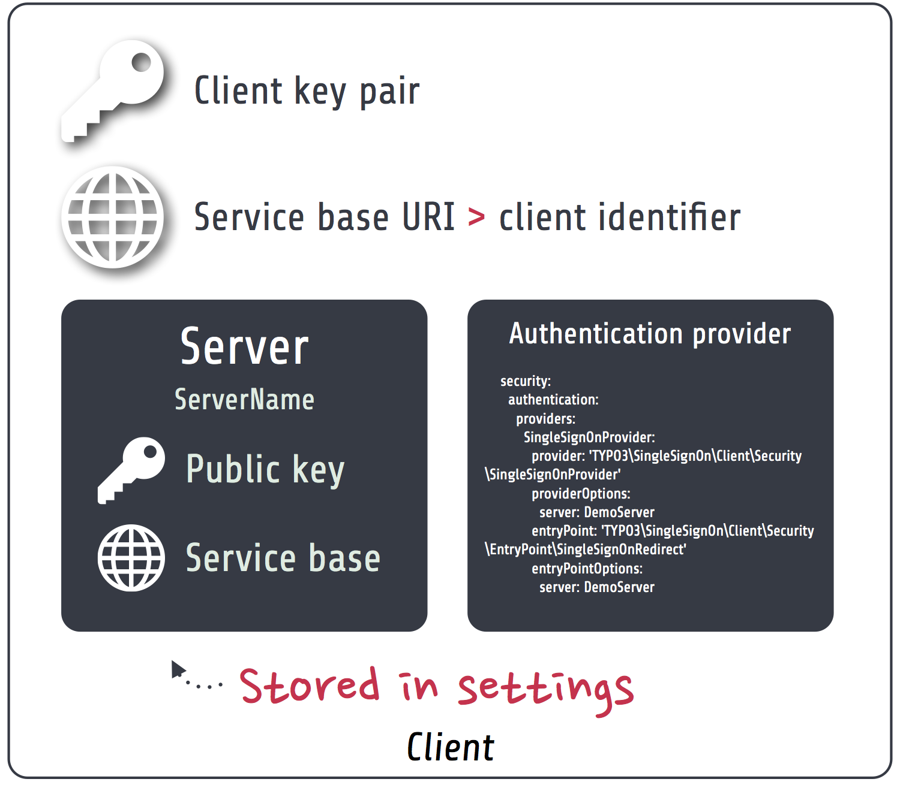

.. index::
   single: Client

Single sign-on client
==========================

The `Flowpack.SingleSignOn.Client` package is needed on any instance that should participate in the single sign-on
process. It can be installed in any TYPO3 Flow (> version 2.x) application and configured through the security
framework.

No special requirements exist for an application to become a single sign-on instance, except that it should be reachable
by the server for the server-side requests (e.g. for :ref:`Client notification`). Furthermore the client does not require
any persistence storage (besides the default Flow session) or database access.

Components
----------------

This is a schematic view of the single sign-on client components that are part of a TYPO Flow application which is
called an *instance*.

.. index::
   single: Client; Key pair

Client key pair
    The client has a *public / private key pair* for encryption and request verification. The public key is shared with
    all servers that are used by the client (most of the time there will be only one server).

.. index::
   single: Client; Service base URI

Service base URI
    The client exports HTTP services on a specific URL path. This path acts as the *Service base URI*
    (e.g. `http://ssoinstance.local/sso/`) or *client identifier*. It is used to register the client on the server.

.. index::
   single: Client; Servers

Servers
    The client configuration has a list of servers that could be used for the actual authentication provider options.
    From an architecture point of view it's possible to use different single sign-on servers in the same application,
    although that should be a rare use-case.

.. index::
   single: Client; Authentication provider
   single: Client; Entry point

Authentication provider and entry point
    The client package provides a special `SingleSignOnProvider` authentication provider and `SingleSignOnRedirect`
    entry point which have to be configured in the TYPO3 Flow security framework for the single sign-on to be used
    as the authentication method. See `Configuration / Authentication`_.

Configuration
-----------------------

Package configuration
^^^^^^^^^^^^^^^^^^^^^

The `Flowpack.SingleSignOn.Client` package provides the following default configuration:

.. code-block:: yaml

    Flowpack:
      SingleSignOn:
        Client:
          # SSO client configuration
          client:
            # The client service base URI as the client identifier
            # Must point to the URI where the SSO client routes are mounted
            serviceBaseUri: ''
            # The client key pair fingerprint
            publicKeyFingerprint: ''

          # A list of named SSO server configurations
          server:
            # Example server configuration
            #
            #   DemoServer:
            #     publicKeyFingerprint: 'bb5abb57faa122cc031e3c904db3d751'
            #     serviceBaseUri: 'http://ssoserver/sso'

          accountMapper:
            # Map a party type from the server to the instance, more complex scenarios
            # need a specialized account mapper implementation (see GlobalAccountMapperInterface)
            #
            # typeMapping:
            #   'Vendor\MyServer\Domain\Model\SomeParty': 'Vendor\MyApplication\Domain\Model\OtherParty'
            #
            typeMapping: []

+------------------------------------------+------------------------------------------+-----------+---------+--------------+
+ Option                                   + Description                              + Mandatory + Type    + Default      +
+==========================================+==========================================+===========+=========+==============+
+ client.serviceBaseUri                    + The service base URI for this client     + Yes       + string  +              +
+------------------------------------------+------------------------------------------+-----------+---------+--------------+
+ client.publicKeyFingerprint              + Key pair fingerprint for the client      + Yes       + string  +              +
+------------------------------------------+------------------------------------------+-----------+---------+--------------+
+ server                                   + Array of named server configurations,    + Yes       + array   +              +
+                                          + server name (not identifier) as the key  +           +         +              +
+------------------------------------------+------------------------------------------+-----------+---------+--------------+
+ server.ServerName.publicKeyFingerprint   + Public key fingerprint of the server     + Yes       + string  +              +
+------------------------------------------+------------------------------------------+-----------+---------+--------------+
+ server.ServerName.serviceBaseUri         + Service base URI of the server           + Yes       + string  +              +
+------------------------------------------+------------------------------------------+-----------+---------+--------------+
+ accountMapper.typeMapping                + Party type mapping from server to client + No        + array   +              +
+                                          + for SimpleGlobalAccountMapper            +           +         +              +
+------------------------------------------+------------------------------------------+-----------+---------+--------------+

.. note:: The package also configures some settings for TYPO3 Flow. For the signed requests a security firewall
   filter with the name `ssoClientSignedRequests` is configured. This filter can be modified or removed in another
   package configuration or global configuration.

.. _Configuration / Authentication:

Authentication
^^^^^^^^^^^^^^

The client has to be configured as an authentication provider on the instance to use a server for the single sign-on.

.. code-block:: yaml

    TYPO3:
      Flow:
        security:
          authentication:
            providers:
              SingleSignOnProvider:
                provider: 'Flowpack\SingleSignOn\Client\Security\SingleSignOnProvider'
                providerOptions:
                  server: DemoServer
                  globalSessionTouchInterval: 60
                entryPoint: 'Flowpack\SingleSignOn\Client\Security\EntryPoint\SingleSignOnRedirect'
                entryPointOptions:
                  server: DemoServer

This example configuration configures an authentication provider with name `SingleSignOnProvider`
(this can be chosen freely) that uses a single sign-on server configured in
`Flowpack.SingleSignOn.Client.server.DemoServer`. The entry point `SingleSignOnRedirect` needs to be registered for the
single sign-on to intercept unauthenticated requests to secured resources (e.g. policy restriction of a controller action)
and continue after the session is transferred from the server.

The `globalSessionTouchInterval` is a provider level option that configures the amount of seconds that can pass without
touching the *global session* on the server (see :ref:`Session synchronization`).

Routes
^^^^^^

The routes of the client package have to be registered in the global `Routes.yaml`:

.. code-block:: yaml

    ##
    # Flowpack.SingleSignOn.Client subroutes
    #

    -
      name: 'SingleSignOn'
      uriPattern: 'sso/<SingleSignOnSubroutes>'
      subRoutes:
        SingleSignOnSubroutes:
          package: Flowpack.SingleSignOn.Client

The path `sso/` can be freely chosen but will be part of the client service base URI that needs to be used for
:ref:`Client registration`.

Commands
---------------

ssokey:generatekeypair
^^^^^^^^^^^^^^^^^^^^^^

ssokey:exportpublickey
^^^^^^^^^^^^^^^^^^^^^^

Account mapping
---------------

Logging
---------------

HTTP services
---------------

