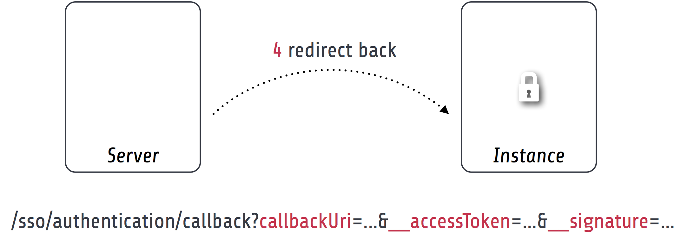

.. index::
   single: Client

Single sign-on client
==========================

The `Flowpack.SingleSignOn.Client` package is needed on any instance that should participate in the single sign-on
process. It can be installed in any TYPO3 Flow (> version 2.x) application and configured through the security
framework.

No special requirements exist for an application to become a single sign-on instance, except that it should be reachable
by the server for the server-side requests (e.g. for :ref:`Client notification`). Furthermore the client does not require
any persistence storage (besides the default Flow session) or database access.

Components
----------------

This is a schematic view of the single sign-on client components that are part of a TYPO Flow application which is
called an *instance*.

.. index::
   single: Client; Key pair

Client key pair
    The client has a *public / private key pair* for encryption and request verification. The public key is shared with
    all servers that are used by the client (most of the time there will be only one server).

.. index::
   single: Client; Service base URI

Service base URI
    The client exports HTTP services on a specific URL path. This path acts as the *Service base URI*
    (e.g. `http://ssoinstance.local/sso/`) or *client identifier*. It is used to register the client on the server.

.. index::
   single: Client; Servers

Servers
    The client configuration has a list of servers that could be used for the actual authentication provider options.
    From an architecture point of view it's possible to use different single sign-on servers in the same application,
    although that should be a rare use-case.

.. index::
   single: Client; Authentication provider
   single: Client; Entry point

Authentication provider and entry point
    The client package provides a special `SingleSignOnProvider` authentication provider and `SingleSignOnRedirect`
    entry point which have to be configured in the TYPO3 Flow security framework for the single sign-on to be used
    as the authentication method. See `Configuration / Authentication`_.

.. index::
   single: Client; Installation

Installation
-----------------------

Installation of the single sign-on client package should be done via Composer:

.. code-block:: bash

    $ path/to/composer.phar require flowpack/singlesignon-client

.. note:: If you extend the client package or want to provide configuration in a custom package you should add
   the `flowpack/singlesignon-client` composer package as a dependency of that package for correct initialization
   order.

.. index::
   single: Client; Configuration

Configuration
-----------------------

Package configuration
^^^^^^^^^^^^^^^^^^^^^

The `Flowpack.SingleSignOn.Client` package provides the following default configuration:

.. code-block:: yaml

    Flowpack:
      SingleSignOn:
        Client:
          # SSO client configuration
          client:
            # The client service base URI as the client identifier
            # Must point to the URI where the SSO client routes are mounted
            serviceBaseUri: ''
            # The client key pair fingerprint
            publicKeyFingerprint: ''

          # A list of named SSO server configurations
          server:
            # Example server configuration
            #
            #   DemoServer:
            #     publicKeyFingerprint: 'bb5abb57faa122cc031e3c904db3d751'
            #     serviceBaseUri: 'http://ssoserver/sso'

          accountMapper:
            # Map a party type from the server to the instance, more complex scenarios
            # need a specialized account mapper implementation (see GlobalAccountMapperInterface)
            #
            # typeMapping:
            #   'Vendor\MyServer\Domain\Model\SomeParty': 'Vendor\MyApplication\Domain\Model\OtherParty'
            #
            typeMapping: []

          log:
            # Enable logging of failed signed requests (signature verification errors)
            logFailedSignedRequests: FALSE

+------------------------------------------+------------------------------------------+-----------+---------+--------------+
+ Option                                   + Description                              + Mandatory + Type    + Default      +
+==========================================+==========================================+===========+=========+==============+
+ client.serviceBaseUri                    + The service base URI for this client     + Yes       + string  +              +
+------------------------------------------+------------------------------------------+-----------+---------+--------------+
+ client.publicKeyFingerprint              + Key pair fingerprint for the client      + Yes       + string  +              +
+------------------------------------------+------------------------------------------+-----------+---------+--------------+
+ server                                   + Array of named server configurations,    + Yes       + array   +              +
+                                          + server name (not identifier) as the key  +           +         +              +
+------------------------------------------+------------------------------------------+-----------+---------+--------------+
+ server.ServerName.publicKeyFingerprint   + Public key fingerprint of the server     + Yes       + string  +              +
+------------------------------------------+------------------------------------------+-----------+---------+--------------+
+ server.ServerName.serviceBaseUri         + Service base URI of the server           + Yes       + string  +              +
+------------------------------------------+------------------------------------------+-----------+---------+--------------+
+ accountMapper.typeMapping                + Party type mapping from server to client + No        + array   +              +
+                                          + for SimpleGlobalAccountMapper            +           +         +              +
+------------------------------------------+------------------------------------------+-----------+---------+--------------+
+ log.logFailedSignedRequests              + Controls logging of failed signed        + No        + boolean + FALSE        +
+                                          + requests via an aspect (for debugging)   +           +         +              +
+------------------------------------------+------------------------------------------+-----------+---------+--------------+

.. note:: The package also configures some settings for TYPO3 Flow. For the signed requests a security firewall
   filter with the name `ssoClientSignedRequests` is configured. This filter can be modified or removed in another
   package configuration or global configuration.

.. _Configuration / Authentication:

Authentication
^^^^^^^^^^^^^^

The client has to be configured as an authentication provider on the instance to use a server for the single sign-on.

.. code-block:: yaml

    TYPO3:
      Flow:
        security:
          authentication:
            providers:
              SingleSignOnProvider:
                provider: 'Flowpack\SingleSignOn\Client\Security\SingleSignOnProvider'
                providerOptions:
                  server: DemoServer
                  globalSessionTouchInterval: 60
                entryPoint: 'Flowpack\SingleSignOn\Client\Security\EntryPoint\SingleSignOnRedirect'
                entryPointOptions:
                  server: DemoServer

This example configuration configures an authentication provider with name `SingleSignOnProvider`
(this can be chosen freely) that uses a single sign-on server configured in
`Flowpack.SingleSignOn.Client.server.DemoServer`. The entry point `SingleSignOnRedirect` needs to be registered for the
single sign-on to intercept unauthenticated requests to secured resources (e.g. policy restriction of a controller action)
and continue after the session is transferred from the server.

The `globalSessionTouchInterval` is a provider level option that configures the amount of seconds that can pass without
touching the *global session* on the server (see :ref:`Session synchronization`).

Routes
^^^^^^

The routes of the client package have to be registered in the global `Routes.yaml`:

.. code-block:: yaml

    ##
    # Flowpack.SingleSignOn.Client subroutes
    #

    -
      name: 'SingleSignOn'
      uriPattern: 'sso/<SingleSignOnSubroutes>'
      subRoutes:
        SingleSignOnSubroutes:
          package: Flowpack.SingleSignOn.Client

The path `sso/` can be freely chosen but will be part of the client service base URI that needs to be used for
:ref:`Client registration`.

.. index::
   single: Client; Commands

Commands
---------------

.. index::
   single: Command; ssokey:generatekeypair

ssokey:generatekeypair
^^^^^^^^^^^^^^^^^^^^^^
The client package provides a `ssokey:generatekeypair` command to create a new public / private key pair (usable for
client or server)::

    Generate key pair command

    COMMAND:
      flowpack.singlesignon.client:ssokey:generatekeypair

    USAGE:
      ./flow ssokey:generatekeypair

    DESCRIPTION:
      Creates a new key pair and imports it into the wallet.
      Used by SSO client and server.

*Example:*

.. code-block:: bash

    $ ./flow ssokey:generatekeypair
    Created key with fingerprint: ee60cb20fab84db9136903e107657b7f

The returned hash is the public key fingerprint of the created key pair.

.. note:: The generated private key is unencrypted and should be kept secretly (the keys are stored in the RsaWallet by
   default in `Data/Persistent/RsaWalletData`).

.. index::
   single: Command; ssokey:exportpublickey

ssokey:exportpublickey
^^^^^^^^^^^^^^^^^^^^^^

The server and client need the full public key from either side. This can be done by exporting the public from a key pair
on the server or instance and importing it on the other side by using the core command `security:importpublickey`. For
the export of a public key the client package ships a `ssokey:exportpublickey` command::

    Export a public key

    COMMAND:
      flowpack.singlesignon.client:ssokey:exportpublickey

    USAGE:
      ./flow ssokey:exportpublickey <public key fingerprint>

    ARGUMENTS:
      --public-key-fingerprint

*Example:*

Generating a key pair for the single sign-on client on an instance:

.. code-block:: bash

    $ cd path/to/instance

    $ ./flow ssokey:generatekeypair
    Created key with fingerprint: ee60cb20fab84db9136903e107657b7f

    $ ./flow ssokey:exportpublickey ee60cb20fab84db9136903e107657b7f > instance.pub

Importing the key for the client on the server (needs file instance.pub on the server):

.. code-block:: bash

    $ cd path/to/server

    $ ./flow security:importpublickey < instance.pub
    The public key has been successfully imported. Use the following uuid to refer to it in the RSAWalletService:

    ee60cb20fab84db9136903e107657b7f

.. index::
   single: Client; Authentication callback

Authentication callback
-----------------------

The client exposes a public action for *authentication callback* that accepts a request from the server after the
authentication on the server for the single sign-on was successful. The request contains query arguments for the
`callbackUri`, a server generated encrypted :ref:`Access token <Access tokens>` and a signature over the arguments for verification.

To verify the authenticity of the request the signature is checked against the public key of the configured server and
the access token is decrypted with the client private key. The next step is the :ref:`Access token redemption` with a
server-side signed request from the instance to the server.

.. index::
   single: Client; Account mapping

Account mapping
---------------

The server will respond with the account data of the authenticated account in the *global session* that is prepared
through account mapping on the server.

.. image:: Images/server-redeem-token.png
        :alt: Redeem an access token
        :width: 80%
        :align: center

The client needs to map this data to a local account with a `GlobalAccountMapperInterface` implementation:

.. code-block:: php

    interface GlobalAccountMapperInterface {

    	/**
    	 * @param \Flowpack\SingleSignOn\Client\Domain\Model\SsoClient $ssoClient
    	 * @param array $globalAccountData
    	 * @return \TYPO3\Flow\Security\Account
    	 */
    	public function getAccount(
    		\Flowpack\SingleSignOn\Client\Domain\Model\SsoClient $ssoClient,
    		array $globalAccountData
    	);

    }

A default implementation of this interface is shipped in the client package with the class `SimpleGlobalAccountMapper`
that will be used by default.

.. index::
   single: Client; SimpleGlobalAccountMapper

SimpleGlobalAccountMapper
^^^^^^^^^^^^^^^^^^^^^^^^^

This global account mapper implementation expects the account data in a schema that matches the
:ref:`SimpleClientAccountMapper` on the server:

*Example account data:*

.. code-block:: yaml

    accountIdentifier: 'jdoe'
    roles: ['Vendor.MyPackage:User']
    party:
      __type: 'Vendor\MyPackage\ExampleParty'
      company: 'Acme Inc.'

The account mapper will instantiate a new `Account` instance that is transient and *should not be persisted* as for every
single sign-on process a new Account will be created. If the authenticated account needs to be referenced by other
domain models a custom global account mapper implementation has to be created that could create new persisted accounts
lazily and update their data according to the given account data. Because this is very domain specific we do not ship
a default implementation for this mapping strategy.

The party type is given as the key `party.__type` and will be mapped to a type on the instance using the
`Flowpack.SingleSignOn.Client.accountMapper.typeMapping` setting. This setting allows to have a simple one-to-one
mapping between classes on the server and on the instance. The property names in the account data have to match for
the default implementation.

.. index::
   single: Client; Logging

Logging
---------------

The client package performs no special logging besides a logging aspect for signed request debugging. The aspect to log
failed signed requests with signature verification errors can be enabled via the
`Flowpack.SingleSignOn.Client.log.logFailedSignedRequests` setting. The requests are logged to the Flow security logger.

.. index::
   single: Client; HTTP services

HTTP services
---------------

This is a list of all HTTP services (controller actions) that are exposed by the client. The URI path depends on the
global Routes.yaml that mounts the package subroutes, we expect the routes to be mounted at `/sso/<SingleSignOnSubroutes>`.

Public
^^^^^^^^^^

`/sso/authentication/callback`
    Route for the `authentication callback`_, has to be accessible for all users that should authenticate
    using the single sign-on.

Private
^^^^^^^^^^

The controller for these routes are protected by a signed request firewall filter and should only be accessible by
a single sign-on server. We strongly suggest to take additional measures for securing the server-side channel between
the server and instances (e.g. SSL with client certificates, firewall rules, additional request filter).

.. warning:: The default TYPO3 Flow routes could allow access to controller actions even though the URI paths are secured
   by a firewall or webserver configuration.

`/sso/session/{sessionId}/destroy`
    Route for the :ref:`single sign-off` to destroy the local session on an instance when a user logs out on another
    instance or the server.
