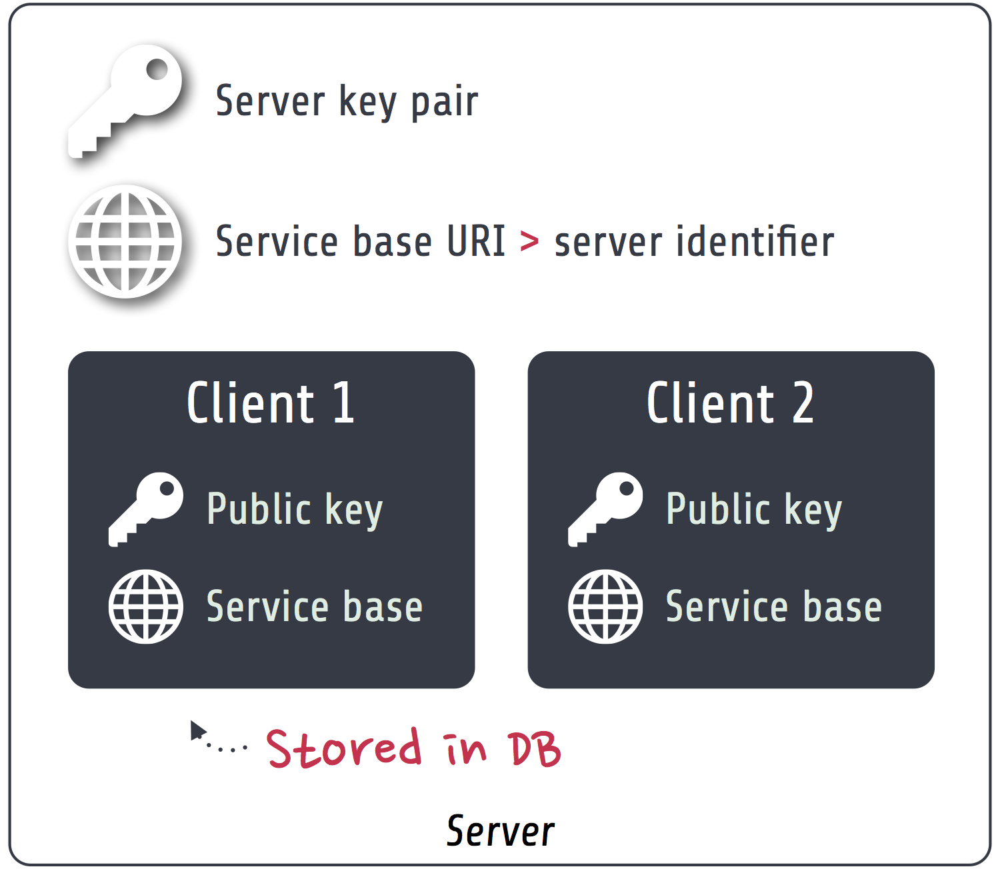
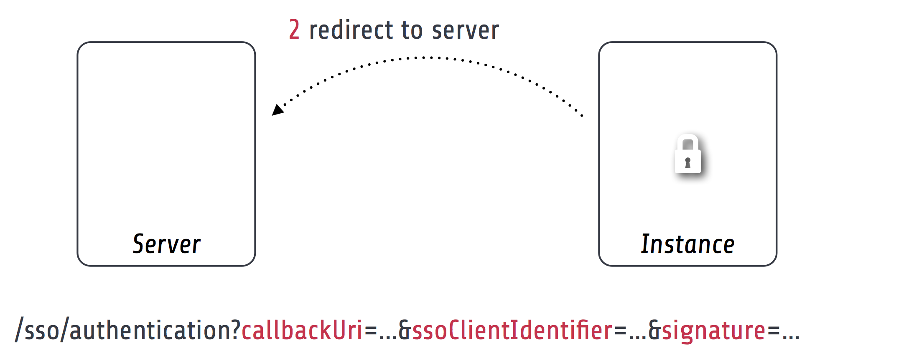
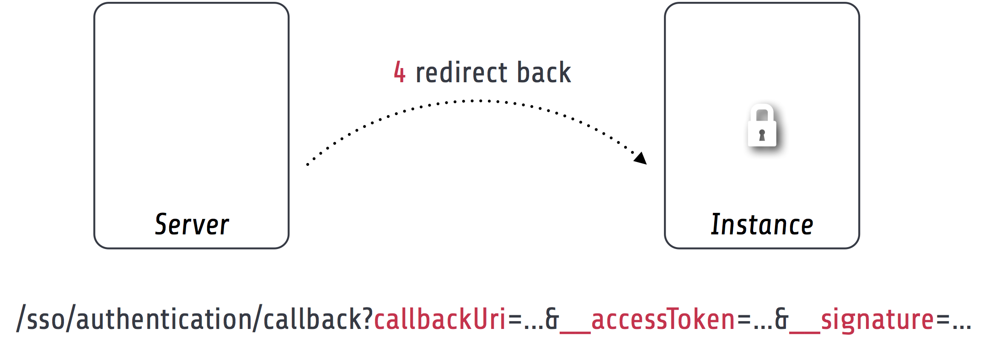
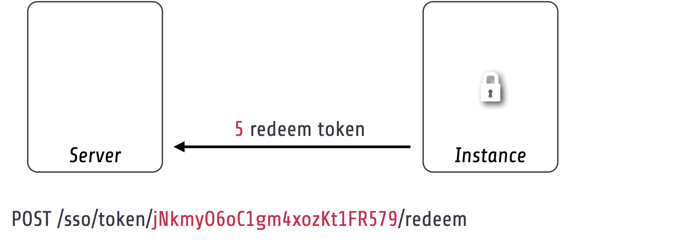

.. index::
   single: Server

Single sign-on server
=====================

The `Flowpack.SingleSignOn.Server` package provides the components for implementing a custom single sign-on server.
This package should be installed in a Flow application that implements custom domain logic and authentication
configuration in a project specific package.

Requirements for a single sign-on server:

* Implementation of a Party domain model and domain logic
* Configuration of authentication
* Inclusion of routes for HTTP services
* Establish a secure server-side communication between the server and instances (e.g. SSL with certificates)
* Party and account management (optional)
* Basic user interface for login and display of messages (optional)

Components
----------

This is a schematic view of the single sign-on server components:

.. index::
   single: Server; Key pair

Server key pair
    The server has a *public / private key pair* for encryption and verification of requests. The public key is shared
    with all instances that should access the server.

.. index::
   single: Server; Service base URI

Service base URI
    The server exports HTTP services on a specific URL path. This path acts as the *Service base URI*
    (e.g. `http://ssoserver.local/sso/`) or *server identifier*.

.. index::
   single: Server; Clients

Clients
    All the instances have to be registered as a single sign-on client with their public key and service base URI. This
    allows for (signed) server-side requests initiated by the client or the server. The client public key restricts
    access to the single sign-on only to explicitly registered clients. The clients are persisted as entities inside a
    configured database. A management interface for the clients can be implemented in a custom package.

.. note:: The server uses the default Flow security framework for authentication during single sign-on requests. So a
   user that doesn't have an authenticated session on the server will be delegated to one of the configured
   authentication providers.

TODO Show usage of authentication provider and accounts on server

.. index::
   single: Server; Configuration

Configuration
-----------------------

Package configuration
^^^^^^^^^^^^^^^^^^^^^

The `Flowpack.SingleSignOn.Server` package provides the following default configuration:

.. code-block:: yaml

    Flowpack:
      SingleSignOn:
        Server:
          server:
            # The service base URI for this server
            serviceBaseUri: ''
            # Mandatory key pair uuid (fingerprint) for the SSO server
            keyPairFingerprint: ''
          log:
            backend: TYPO3\Flow\Log\Backend\FileBackend
            backendOptions:
              logFileURL: %FLOW_PATH_DATA%Logs/SingleSignOn_Server.log
              createParentDirectories: TRUE
              severityThreshold: %LOG_WARN%
              maximumLogFileSize: 10485760
              logFilesToKeep: 1
              logMessageOrigin: FALSE

            # Enable logging of request signing (all signed requests)
            logRequestSigning: FALSE

+-----------------------------+------------------------------------------+-----------+---------+--------------+
+ Option                      + Description                              + Mandatory + Type    + Default      +
+=============================+==========================================+===========+=========+==============+
+ server.serviceBaseUri       + The service base URI for this server     + Yes       + string  +              +
+-----------------------------+------------------------------------------+-----------+---------+--------------+
+ server.keyPairFingerprint   + Key pair fingerprint for the server      + Yes       + string  +              +
+-----------------------------+------------------------------------------+-----------+---------+--------------+
+ log.backend                 + Log backend type for the single sign-on  + No        + string  + FileBackend  +
+                             + logger                                   +           +         +              +
+-----------------------------+------------------------------------------+-----------+---------+--------------+
+ log.backendOptions          + Log backend options for the single       + No        + array   + see Settings +
+                             + sign-on logger                           +           +         +              +
+-----------------------------+------------------------------------------+-----------+---------+--------------+
+ log.logRequestSigning       + Controls logging of signed requests via  + No        + boolean + FALSE        +
+                             + an aspect (for debugging)                +           +         +              +
+-----------------------------+------------------------------------------+-----------+---------+--------------+
+ accountMapper.configuration + Serialization of account data for client + No        + array   + NULL         +
+                             + account mapping in the default           +           +         +              +
+                             + SimpleClientAccountMapper_.              +           +         +              +
+-----------------------------+------------------------------------------+-----------+---------+--------------+

.. note:: The package also configures some settings for TYPO3 Flow. For the signed requests a security firewall
   filter with the name `ssoServerSignedRequests` is configured. This filter can be modified or removed in another
   package configuration or global configuration.

Caches
^^^^^^

A special cache with the identifier `Flowpack_SingleSignOn_Server_AccessToken_Storage` is used for the storage
of `Access tokens`_. It defaults to a `FileBackend` as the cache backend.

Routes
^^^^^^

The routes of the server package have to be registered in the global `Routes.yaml`:

.. code-block:: yaml

    ##
    # Flowpack.SingleSignOn.Server subroutes
    #

    -
      name: 'SingleSignOn'
      uriPattern: 'sso/<SingleSignOnSubroutes>'
      subRoutes:
        SingleSignOnSubroutes:
          package: Flowpack.SingleSignOn.Server

The path `sso/` can be freely chosen but will be part of the server service base URI that needs to be configured in the
client configuration on a single sign-on instance.

.. index::
   single: Server; Commands

Commands
-----------------------

.. index::
   single: Command; ssoserver:registerclient

ssoserver:registerclient
^^^^^^^^^^^^^^^^^^^^^^^^

The server exposes a `ssoserver:registerclient` command for client registration from the CLI::

    Add a client

    COMMAND:
      flowpack.singlesignon.server:ssoserver:registerclient

    USAGE:
      ./flow ssoserver:registerclient <base uri> <public key>

    ARGUMENTS:
      --base-uri           The client base URI as the client identifier
      --public-key         The public key fingerprint (has to be imported using the
                           RSA wallet service first)

    DESCRIPTION:
      This command registers the specified client at the SSO server.

The key pair has to be created on the instance using the `ssokey:generatekeypair` command (TODO reference section in the client doc).

*Example:*

.. code-block:: bash

    $ ./flow ssoserver:registerclient --base-uri http://ssoinstance.local/sso/ --public-key c1285a470f0fc8f14f54851c5d8eb32f

.. index::
   single: Command; ssoserver:removeexpiredaccesstokens

ssoserver:removeexpiredaccesstokens
^^^^^^^^^^^^^^^^^^^^^^^^^^^^^^^^^^^

The `ssoserver:removeexpiredaccesstokens` command cleans up expired `access tokens`_ from the underlying cache backend.

::

    Remove expired access tokens

    COMMAND:
      flowpack.singlesignon.server:ssoserver:removeexpiredaccesstokens

    USAGE:
      ./flow ssoserver:removeexpiredaccesstokens

    DESCRIPTION:
      This will remove all expired access tokens that were not redeemed from the underlying storage.
      This command should be executed in regular intervals for cleanup.

This command should be executed in regular intervals (e.g. using a cron task) to clean up the access token storage.

.. index::
   single: Server; Logging
   single: Server; Logs

Logging
-----------------------

The server package Configuration_ configures a default logger that is used in the single sign-on package for logging
various events. The default file for the logger in *Production* context is `Data/Logs/SingleSignOn_Server.log`.

.. tip:: The log should always be consulted if problems with the single sign-on need to be investigated. In the log
   level `INFO` it provides an overview of all single sign-on authentications.

.. warning:: Access to the logs must be restricted in production since it contains sensible information
   (session identifiers and access tokens).

The logger interface can be injected in any package to log into the same destination:

.. code-block:: php

    /**
     * @var \Flowpack\SingleSignOn\Server\Log\SsoLoggerInterface
     * @Flow\Inject
     */
    protected $ssoLogger;

.. index::
   single: Server; Client registration
   single: Client; Registration

.. _Client registration:

Client registration
-----------------------

Clients of single sign-on instances need to be registered on the server before they can participate in the single
sign-on. The server needs the client service base URI and public key for encryption of request parameters, server-side
client notification and request signing.

The server package implements the `ssoserver:registerclient`_ command for that purpose.

Programmatic client registration
^^^^^^^^^^^^^^^^^^^^^^^^^^^^^^^^

For deployments with many single sign-on instance and respective clients a programmatic registration could be wanted.
Since clients are represented by persisted entities this is as easy as creating a new entity and adding it to the
repository.

.. code-block:: php

    $ssoClient = new \Flowpack\SingleSignOn\Server\Domain\Model\SsoClient();
    $ssoClient->setServiceBaseUri($baseUri);
    $ssoClient->setPublicKey($publicKeyFingerprint);
    $this->ssoClientRepository->add($ssoClient);

It should be trivial to build a management interface for client management.

.. tip:: Programmatic access to the RSA wallet for key management is easy with an instance of
   `\TYPO3\Flow\Security\Cryptography\RsaWalletServiceInterface`.

.. index::
   single: Server; Authentication endpoint

Authentication endpoint
-----------------------

The single sign-on server exposes a public controller action for handling authentication requests from clients. This is called
the *authentication endpoint*.

The single sign-on client entry point on the instance will redirect a user to the *authentication endpoint* on the
server if no authenticated session is present locally on the client. This redirect happens *in the browser* of the user
to access an existing web session of the server (if the user authenticated on the server or another instance before).

To secure the parameters and guard against a `possible redirection attack`_ the parameters are signed by
the client in the `signature` query argument. This is done using the private key of the client, so the server can
verify the signature with the client public key and also verify the identity of the request.

A `ClientNotFoundException` will be thrown if the client was not registered on the server.

The authentication endpoint action will act as an authentication controller and eventually call
`$this->authenticationManager->authenticate()`, so the user has to authenticate using a configured authentication
provider to proceed. This approach integrates nicely with the Flow security framework and allows the usage of all
available authentication providers and entry points.

.. note:: There has to be an entry point (e.g. `WebRedirect`) that matches the authentication endpoint request.
   Otherwise a user would not have a chance to authenticate using a login form (or other means depending on the
   authentication provider). See :ref:`About the demo server` for an example configuration.

.. index::
   single: Server; Authentication callback

Authentication callback
-----------------------

After the user was authenticated on the server or if the user was already authenticated an *access token* is created on
the server and sent to the instance via an redirect *in the browser* to the client *authentication callback*.

Since the redirect to the client should be considered insecure the access token is encrypted and signed with the client
public key and server private key.

.. index::
   single: Server; Access token

Access tokens
^^^^^^^^^^^^^

The access token stores the account that was authenticated on the server and the client that initiated the
authentication request. An access token is identified by a string of 32 random characters. An access token has an expiry
setting which defaults to 60 seconds. This and the fact that an access token is deleted after redemption should prevent
replay attacks.

Access tokens are stored in a cache backend `Flowpack_SingleSignOn_Server_AccessToken_Storage`. The default
configuration_ uses a `FileBackend`. The cache backend allows for a flexible and lightweight storage of access tokens
with automatic expiration and garbage collection.

The server package provides a `ssoserver:removeexpiredaccesstokens` command for the maintenance of the cache backend
that will remove expired access tokens that were not redeemed. This command should be executed in regular intervals
for garbage collection of the cache backend.

.. index::
   single: Server; Access token redemption
   single: Server; Redeem access token

.. _redeem access token:

Access token redemption
-----------------------

After the single sign-on client has verified the access token a server-side `signed request`_ is made to exchange the
access token for the actual account data and *single sign-on session identifier*. This measure also prevents injection
of arbitrary account data into the callback URI by breaking the signature.

With a valid access token the server will:

* get the original session identifier and account from the access token
* invalidate (remove) the access token
* register the single sign-on client in the session for `Client notification`_
* perform `Account mapping`_ to transform the server account into authentication and authorization information for the
  client
* respond with a JSON representation of the mapped account and the server session identifier

The client will transform the returned account data into a local account (persistent or transient) using a
`global account mapper` and authenticate this account locally.

.. note:: The redeem access token request is not public and is guarded by a signed request filter by default.
   Additional measures to secure this channel should be installed in production environments.

.. index::
   single: Server; Account mapping

Account mapping
-----------------------

Since the account and party information that is needed on an instance is dependent on the actual requirements of an
application the single sign-on solution does not impose a fixed schema for the information.

With an implementation of the `ClientAccountMapperInterface` any strategy for a transformation given the account
and client instance can be implemented:

.. code-block:: php

    interface ClientAccountMapperInterface {

    	/**
    	 * Map the given account as account data for an instance
    	 *
    	 * @param \Flowpack\SingleSignOn\Server\Domain\Model\SsoClient $ssoClient
    	 * @param \TYPO3\Flow\Security\Account $account
    	 * @return array
    	 */
    	public function getAccountData(
    		\Flowpack\SingleSignOn\Server\Domain\Model\SsoClient $ssoClient,
    		\TYPO3\Flow\Security\Account $account
    	);

   }

The `getAccountData` method has to return the serialized account information based on the given single sign-on client
and account object. It is possible to differentiate between clients and return different account information depending
on the client with this approach.

.. index::
   single: Server; SimpleClientAccountMapper

SimpleClientAccountMapper
^^^^^^^^^^^^^^^^^^^^^^^^^

A basic implementation of a client account mapper is included in the server package with the `SimpleClientAccountMapper`
class and will be used by default.

*Example account data:*

.. code-block:: yaml

    accountIdentifier: 'jdoe'
    roles: ['Vendor.MyPackage:User']
    party:
      __type: 'Vendor\MyPackage\ExampleParty'
      company: 'Acme Inc.'

The `accountIdentifier` and `roles` keys are always returned and do not need any configuration.

The implementation will serialize the party properties according to the `configuration` property which is configurable via the
`Flowpack.SingleSignOn.Server.accountMapper.configuration` setting.

The default configuration will handle the party type `Person` and returns all simple properties including the name:

.. code-block:: php

    array(
    	'party' => array(
    		'_exposeType' => TRUE,
    		'_descend' => array('name' => array())
    	)
    );

For any other party implementation it will just return accessible properties directly under the party object, so for
relational party data a custom configuration has to be given.

It is important that the type of the party is exposed as the key `__type` for the default implementation of the
`global account mapper`_ on the client (class `SimpleGlobalAccountMapper`).

.. note:: The exchange of account data is deliberately unconstrained to allow for a fully flexible exchange of data. But the
   implementation of the `ClientAccountMapperInterface` on the server and `GlobalAccountMapperInterface` on the client
   have to match in terms of the exported and expecteded properties.

.. index::
   single: Server; Client notification
   single: Single sign-off

.. _Single sign-off:
.. _Client notification:

Client notification
-----------------------

The client notification is used to destroy sessions remotely by a server-side request to the client.
This is mainly used for synchronized logout (*Single sign-off*) and account switching on the server.

The server declares a `SsoClientNotifierInterface` interface for this purpose and provides two implementations using
a synchronous (`SimpleSsoClientNotifier`) and parallel (`ParallelSsoClientNotifier`) strategy for the HTTP requests.
The `SimpleSsoClientNotifier` is the default implementation configured in the server package `Objects.yaml`. In scenarios
that register a lot of instances for one session the `ParallelSsoClientNotifier` can reduce the latency on logout or
account switching by using parallel HTTP requests with a multi-threading engine.

A destroyed session on the client will require authentication through the single sign-on mechanism on the next request
to a secured resource on the client. This ensures an updated authentication state on the instance.

.. note:: The client notification will destroy all session data on the client. If the instance stores important
   data in the session this data will be lost on logout or account switching on another instance or the server.

.. index::
   single: Session; Synchronization
   single: Session; global
   single: Session; local

.. _Session synchronization:

Session synchronization
-----------------------

The TYPO3 Flow session has a configurable interval for inactivity that is used to expire sessions after a certain
time of inactivity on the next access or through garbage collection.

In a single sign-on scenario we have to consider multiple Flow sessions (after authentication with at least one instance):

* One *global* session on the single sign-on server
* One ore more *local* sessions on the instances

The server and instances could have different inactivity timeouts configured for the Flow session which leads to an
effect where the user is still authenticated on the client but the server session is already expired due to inactivity
(for most scenarios the user will access the server very infrequently). It is desirable that the session lifetime is
synchronized in a single sign-on setup, such that an expired session on the server will also expire the session on the
instances.

The Flowpack single sign-on solution does use a regular *touch* on the *global* session from the client through a
special server-side signed request. The interval and frequency is configurable for the single sign-on client.

The server will respond with an error code `SessionNotFound` if the session was not found / inactive and the client will
mark the authentication token as no longer authenticated.

.. index::
   single: Account; Impersonation

Account impersonation
-----------------------

The `authentication endpoint`_ gets the current account that should be passed to the instance through the `AccountManager`
service, which is implemented in the server package.

The method `impersonateAccount` allows to *impersonate* another account that will be visible as the globally authenticated
account. The original account is still authenticated on the server which allows to switch back to the original or yet another
account. As in the case of re-authentication on the server all registered client sessions are destroyed on impersonation.

This feature could be used to implement multi-tenant applications where one global account is able to use multiple
other accounts and the user should be able to select the currently active account.

.. note:: A single sign-on server UI should always use the methods in `AccountManager` to get the currently active
   account (through `getServerAccount` or `getImpersonatedAccount`) to display authentication information.

.. index::
   single: Server; HTTP services

HTTP services
-----------------------

This is a list of all HTTP services (controller actions) that are exposed by the server. The URI path depends on the
global Routes.yaml that mounts the package subroutes, we expect the routes to be mounted at `/sso/<SingleSignOnSubroutes>`.

Public
^^^^^^^^^^

`/sso/authentication`
    Route for the `authentication endpoint`_, has to be accessible for all users that should authenticate
    using the single sign-on.

Private
^^^^^^^^^^

The controller for these routes are protected by a signed request firewall filter and should only be accessible by
instances. We strongly suggest to take additional measures for securing the server-side channel between the server
and instances (e.g. SSL with client certificates, firewall rules, additional request filter).

.. warning:: The default TYPO3 Flow routes could allow access to controller actions even though the URI paths are secured
   by a firewall or webserver configuration.

`/sso/token/{accessToken}/redeem`
    Route for the `access token redemption`_, is used by the single sign-on client to verify the
    access token and to exchange it for account data and the global session identifier.

`session/{sessionId}/touch`
    Route for the `session synchronization`_ by allowing a client to touch the global session in regular intervals
    and get feedback about the session status.

`session/{sessionId}/destroy`
    Route for the `single sign-off`_ to destroy the global session when a user logs out on an instance.

.. _possible redirection attack: https://www.owasp.org/index.php/Top_10_2013-A10-Unvalidated_Redirects_and_Forwards
